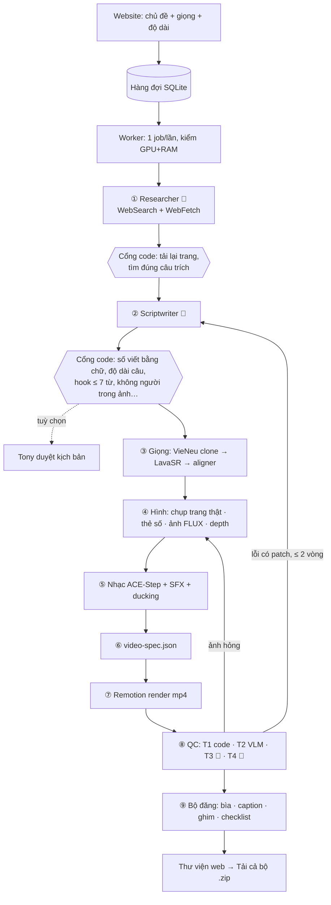

# Hệ thống exp-create-video

Tạo video TikTok tiếng Việt về AI: **chủ đề → nguồn đã kiểm → kịch bản → giọng → hình → nhạc → dựng → kiểm tra →
bộ đăng TikTok**. Chạy trên máy `tony` (RTX 2060 6GB, RAM 31GB), điều khiển qua website trong tailnet.

Cập nhật 2026-10-04. Số thời gian là đo thật trên máy (`out/*/state.json`, trung vị các lần chạy).

---

## 1. Nguyên tắc kiến trúc

- **Python điều phối, mỗi agent là MỘT lần gọi Claude** (`claude-agent-sdk` → `query()`), context mới, output là JSON
  theo schema. Giữa hai agent luôn là **code kiểm** — không có LLM nào tự điều phối LLM khác
  (`research/10-team.md` §1: multi-agent tự do tốn ~15× token và kém ở việc tuần tự).
- **Bàn giao qua file** trong `out/<id>/`. `state.json` ghi từng bước (hash đầu vào, thời gian, số lần gọi LLM, token)
  → chạy lại là nối tiếp từ bước hỏng, không làm lại từ đầu.
- **`video-spec.json` là ranh giới duy nhất Python ↔ Remotion.**
- **QC tầng 1 không dùng LLM** (điểm tựa không bị ảo). **Vòng sửa QC trần cứng 2.**
- **Chi phí 0đ tiền mặt:** model open-weight chạy local; Claude đi qua tài khoản Claude Code (trừ hạn mức gói, không
  tính phí API).
- **6GB VRAM không cho chạy song song:** các khối GPU nạp lần lượt, mỗi khối nhả VRAM trước khi khối sau chạy.

---

## 2. Luồng một video



🤖 = bước có agent Claude.

---

## 3. Từng bước — ai làm, model gì

| # | Bước | Ai làm | Model / công cụ | Chạy trên | Thời gian | Ra file |
|---|---|---|---|---|---|---|
| 0 | Gợi ý chủ đề (6:30 sáng) | code + 🤖 **trend_judge** | gom tin HF/HN/arXiv/RSS/GenK/VnExpress/Google Trends VN · embedding **multilingual-e5-base** · Claude chấm "hợp khán giả VN, giải thích được trong 40s" | CPU/GPU nhỏ | vài phút | `team/trends/<ngày>.json` |
| 1 | Tìm nguồn | 🤖 **researcher** | Claude + WebSearch/WebFetch; **code** tải lại từng trang (trafilatura), giữ sự thật nào có câu trích khớp | mạng | ~4 phút | `brief.json`, `team/snapshots/` |
| 2 | Kịch bản | 🤖 **scriptwriter** | Claude, không tool; rubric nhét trong prompt; **code** `_check` chặn lỗi kỹ thuật | — | 1–3 phút | `script.json` |
| — | Duyệt kịch bản | Tony (tuỳ chọn, mặc định tắt) | web | — | — | — |
| 3 | Giọng đọc | code | **VieNeu-TTS v3 Turbo** (SDK 3.8.3, ONNX) clone giọng Tony / 25 preset · **LavaSR v2** mở rộng băng thông (chỉ giọng clone) · **Qwen3-ForcedAligner-0.6B** timestamp từng từ · **Qwen3-ASR** (exp-echo) nghe lại bắt lỗi lặp chữ · ffmpeg loudnorm −14 LUFS | CPU + GPU nhỏ | ~3 phút | `tts/voice.wav`, `tts/tts.json` |
| 4 | Hình | code | **Playwright Chromium** chụp trang thật, tô vàng câu nói tới · thẻ số/biểu đồ vẽ bằng code · **FLUX.2-klein-4B** fp16 sinh ảnh b-roll (không người) · **SDXL-Lightning** dự phòng · **Depth-Anything-V2-Small** cho parallax 2.5D | GPU | ~4–5 phút | `shots/`, `gen/`, `depth-gen/` |
| 5 | Âm thanh | code | **ACE-Step 1.5** turbo (CPU, cache 4 bản theo seed) · SFX tổng hợp numpy, ≤ 1 cái/5s · ffmpeg sidechain ducking (nhạc dưới giọng ~15 dB) | CPU | ~3s (có cache) / 2–5 phút (lần đầu) | `audio/mix.wav` |
| 6 | Spec | code | gom câu, mốc từ, shot, phụ đề cụm 1–3 từ → JSON schema | CPU | vài giây | `video-spec.json` |
| 7 | Dựng | code | **Remotion** (React, headless Chrome) đọc spec · font Anton · karaoke · punch-in | CPU | ~4–5 phút | `video.mp4` |
| 8a | QC T1 kỹ thuật | **code** (không LLM) | ffprobe + OpenCV: độ dài, độ phân giải, loudness, im lặng, viền đen, đứng hình, chữ lấn vùng UI TikTok, lệch phụ đề + 6 proxy giữ chân (chỉ cảnh báo) | CPU | ~15s | `qc/r<n>/t1.json` |
| 8b | QC T2 hình | code + VLM | **Qwen3-VL-2B-Instruct** nf4: ảnh lệch chủ đề / chữ méo / sai giải phẫu → vẽ lại đúng ảnh hỏng (chỉ khi chữ méo, sai giải phẫu) | GPU ~1,8GB | ~30–50s | `qc/r<n>/t2.json` |
| 8c | QC T3 sức hút | 🤖 **critic_t3** + code | Claude chấm checklist đạt/trượt (không xin điểm 0–10); code tính điểm | — | ~30s | `qc/r<n>/t3.json` |
| 8d | QC T4 sự thật | 🤖 **claim_extractor** → 🤖 **fact_checker** + code | rút claim (cả số trên thẻ) không thấy nguồn → phán từng claim theo snapshot; **code** so số/ngày và kiểm câu trích. Mâu thuẫn = **chặn** | — | ~1–3 phút | `qc/r<n>/t4.json` |
| 8e | Sửa | 🤖 **scriptwriter_revise** | chỉ sửa đúng lỗi T3/T4 chỉ ra, kèm url nguồn → dựng lại (cache: chỉ chạy lại bước đổi) | — | ~6–8 phút/vòng | `qc/decision.json` |
| 9 | Bộ đăng | code | Playwright dựng **ảnh bìa** 1080×1920 · caption + ≤ 5 hashtag (≤ 2.200 ký tự) · bình luận ghim · nguồn · checklist 9 việc trong app | CPU | ~5s | `result.json`, `post/` |

**Agent Claude:** 7 vai — trend_judge, researcher, scriptwriter, scriptwriter_revise, critic_t3, claim_extractor,
fact_checker. Mỗi vai: context mới, `max_turns` + `max_budget_usd`, output JSON schema (`structured_output` rỗng =
fail), ghi token vào `state.json` (`src/create_video/team/role.py`). Model do Claude Code chọn theo gói — các lần chạy
2026-10 ghi nhận **claude-opus-5** (+ claude-haiku-4-5 cho tác vụ phụ của SDK). Một video ~6–10 lần gọi, ~2–3 USD quy
đổi (trừ hạn mức gói, không trả tiền API).

**Tổng thời gian:** ~20–25 phút/video không vòng sửa · +6–8 phút mỗi vòng sửa (trần 2).

---

## 4. Website

| Phần | Công nghệ | Ghi chú |
|---|---|---|
| Truy cập | `tailscale serve --https=8443` → **https://tony.tailfcdcfc.ts.net:8443** | chỉ trong tailnet; xác thực bằng header `Tailscale-User-Login` (allowlist), POST kiểm Origin |
| Web | **FastAPI** + Jinja + **htmx 2** + Alpine.js + **Tailwind v4 + daisyUI 5** (không Node) | responsive: menu trái ≥ 1024px, thanh đáy trên điện thoại; tông xanh dương, Noto Serif Display + Be Vietnam Pro |
| Hàng đợi | SQLite WAL (`exp/web/xuong.db`) | nhận job nguyên tử `BEGIN IMMEDIATE` |
| Worker | process riêng, **1 job/lần** | kiểm VRAM ≥ 3GB + RAM ≥ 8GB trước bước GPU; huỷ = `killpg`; crash → nối tiếp từ `state.json` |
| Dịch vụ | systemd user `xuong-web`, `xuong-worker` (linger) | tự bật lại sau reboot |
| Trang | Tạo video · Hàng đợi · Thư viện · Thống kê · Cài đặt | thống kê `approve_rate` = Đăng/(Đăng+Bỏ) — metric chính |

---

## 5. Bản đồ code

```
src/create_video/
  pipeline.py            điều phối một video (CLI: python -m create_video.pipeline "chủ đề" --qc)
  agents/researcher.py   ① tìm nguồn + cổng code đối chiếu câu trích
  agents/scriptwriter.py ② kịch bản + cổng code `_check`
  voice/                 ③ VieNeu (vieneu_local, worker), LavaSR (bwe), aligner, ASR
  visual/                ④ router, screenshot, flux2, sdxl, depth, regen
  sound/                 ⑤ ACE-Step, SFX, ducking
  spec/                  ⑥ build/validate video-spec.json, phụ đề cụm
  qc/                    ⑧ t1_technical, t2_vlm, t3_appeal, t4_facts, loop (trần 2)
  publish.py, cover.py   ⑨ result.json, thumbnail, bộ đăng, ảnh bìa
  progress.py            tiến độ 8 bước + ETA cho web
  team/                  role.py (chạy 1 agent), state.py, snapshot.py, trend_scout.py
  web/                   app.py, worker.py, db.py, library.py, stats.py, templates/
remotion/                ⑦ React composition đọc video-spec.json
configs/                 models.yaml · style.yaml · thresholds.yaml (ngưỡng viết trước) · rubric.md
```

---

## 6. License model (kênh có kiếm tiền → cấm NC)

| Model | License |
|---|---|
| VieNeu-TTS v3 Turbo (SDK 3.8.3, cả 25 giọng preset) | Apache-2.0 — giọng Tony: riêng, có consent 2026-08-04 |
| LavaSR v2 | Apache-2.0 |
| FLUX.2-klein-4B | Apache-2.0 (bản 9B là NC — không dùng) |
| SDXL-Lightning | OpenRAIL++ |
| Depth-Anything-V2-**Small** | Apache-2.0 (Base/Large là NC) |
| Qwen3-VL-2B · Qwen3-ForcedAligner · Qwen3-ASR | Apache-2.0 |
| ACE-Step 1.5 | MIT |
| multilingual-e5-base | MIT |
| Remotion | miễn phí cho cá nhân/công ty ≤ 3 người (`research/repo-cards/remotion.md`) |

Tài liệu gốc: `research/11-audit-tiktok-ai.md` (research nội dung + audit) · `research/12-web-app.md` (website) ·
`research/10-team.md` (kiến trúc agent) · `research/probes/` (số đo từng bước).

---

## 7. Tóm gọn

- **Làm gì:** gõ một chủ đề (hoặc chọn gợi ý) trên website → ~20–25 phút sau có **bộ đăng TikTok** đầy đủ: video
  dọc 9:16 tiếng Việt + ảnh bìa + caption/hashtag + bình luận ghim + checklist đăng.
- **Vào ở đâu:** https://tony.tailfcdcfc.ts.net:8443 (điện thoại/laptop có bật Tailscale).
- **Agent Claude (7 vai):** gợi ý chủ đề · tìm nguồn · viết kịch bản · sửa kịch bản · chấm sức hút · rút claim ·
  kiểm sự thật. Mỗi vai một lần gọi, có code kiểm ở giữa.
- **Model chạy trên máy:** VieNeu-TTS (giọng) · LavaSR (làm rõ giọng clone) · Qwen3-ForcedAligner + Qwen3-ASR (căn và
  nghe lại lời đọc) · FLUX.2-klein (ảnh) · Depth-Anything (chiều sâu) · ACE-Step (nhạc) · Qwen3-VL (chấm hình) ·
  multilingual-e5 (gom trend). Công cụ: Playwright (chụp trang thật), Remotion (dựng video).
- **Kiểm tra:** T1 kỹ thuật bằng code · T2 hình bằng VLM · T3 sức hút + T4 sự thật bằng Claude. Sai sự thật thì chặn;
  tối đa 2 vòng tự sửa.
- **Chi phí:** 0đ tiền mặt. Bước Claude trừ hạn mức gói (~2–3 USD quy đổi/video); phần còn lại dùng GPU 6GB + CPU của
  máy, mỗi lúc một video.
- **Metric chính:** `approve_rate` = video anh bấm Đăng / tổng đã quyết — xem ở trang Thống kê.
